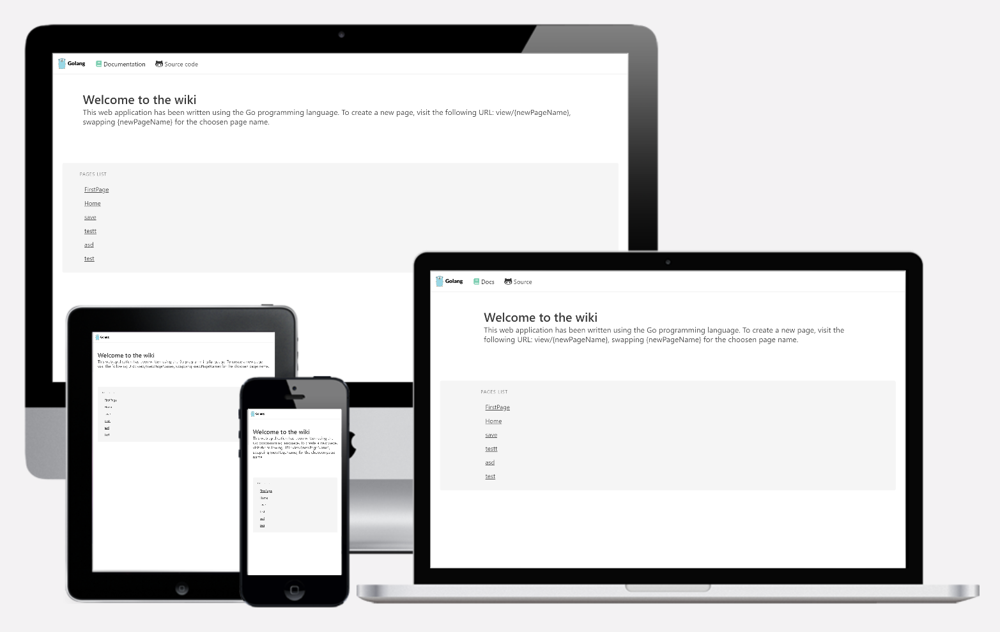

# Go-vanillawiki

Simple implementation of a Go webserver using only native Go components, no external frameworks or libraries, no frills or whatsoever.

The server serves a minimalist wiki editable by anyone.




Run the webserver as such:

```bash
go run main.go
```

You'll see the output in your terminal:
```bash
$ go run main.go

Server started... listening on post 5000
URL: http://localhost:5000/
```

## Demo

Heroku: https://go-vanillawiki.herokuapp.com/

Private web server: _WIP_

## Dependencies

Of course you'll need the [Go cli](https://golang.org/dl/) to run the project.

This wiki.go file uses the following imports, which are necessary to run this web server:

```go
import (
	"fmt"
	"html/template"
	"io/ioutil"
	"log"
	"net/http"
	"os"
	"regexp"
	"strings"
)
```

These packages should be found in your local ~/go/bin folder (or wherever your GOPATH points to).

#

## Pages 

This simple implementation uses some html templates and .txt data sources to create and show individual pages.

Pages are stored in the /pages subdirectory.

This project links to the [bulma.io](https://bulma.io) css library for quick styling.

### Page templates

Templates are stored in the /templates subdirectory.

Two layouts are used, view.html and edit.html and are respectively used by Go whenever accessing the /view/ or /edit/ subfolder from the browser.

A third custom is used by the homepage.

### Page contents

The pages temselves are stored as .txt files.

The page name will become the HTML page title and the body of the file will populate the HTML body.